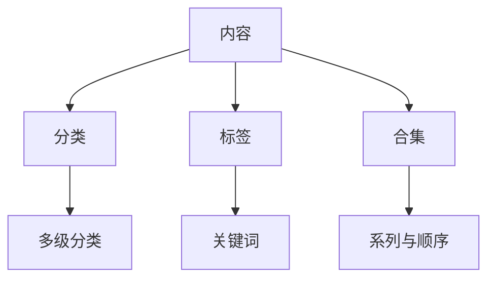
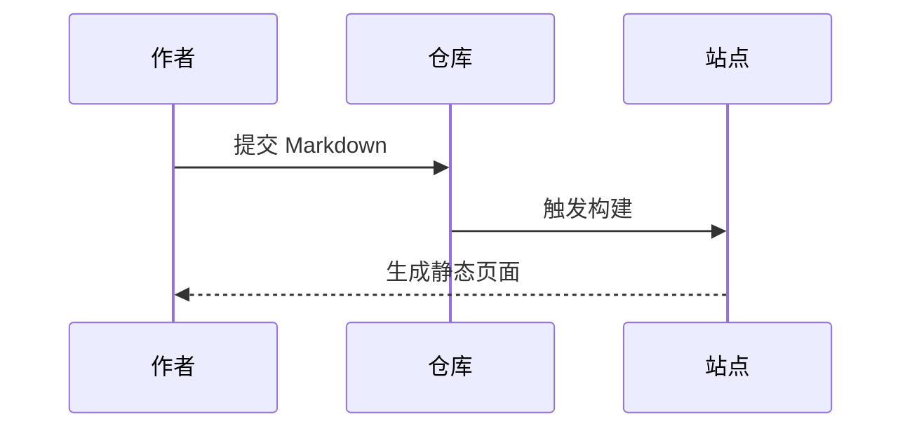

## 数学公式

数学公式由 `remark-math` + `rehype-katex` 驱动，行内公式写作 `$...$`，块级公式写作 `$$...$$`：

行内公式：当 $a \ne 0$ 时，方程 $ax^2 + bx + c = 0$ 有两个解。

块级公式：

$$
x = \frac{-b \pm \sqrt{b^2 - 4ac}}{2a}
$$

也可以用 `math` 代码块书写：

```math
\text{平均绩点(GPA)} = \frac{\sum(\text{课程学分} \times \text{课程绩点})}{\sum \text{课程学分}}
```

::alert{type="warning" title="转义"}
正文中如需直接使用美元符号，请写成 `\$`，否则会被当作公式起始符。
::

## 图表

图表由 `remark-code-component` 插件实现：把 `mermaid` 代码块渲染为 [Mermaid](https://mermaid.js.org/) 图表。它会跟随亮暗模式重绘，进入视口附近才加载渲染器；超宽图表可横向滚动。





## 乐谱

同一插件也支持把 `music-abc` 代码块渲染为可播放的乐谱，语法参见 [ABC notation](https://abcnotation.com/)：

```music-abc
L:1/8
Q:1/4=100
M:2/4
K:D
"D" FA A>B | AF DD/E/ | "G" FF ED | "A" E2 z2 |]
```

::alert{type="info" title="实现方式"}
这三个能力的共同点是：**在 `nuxt.config.ts` 的 remark 插件里，把特定语言的代码块映射为组件**。图表映射到 `Mermaid`，乐谱映射到 `MusicScore`，因此 Markdown 作者无需关心渲染细节。
::
